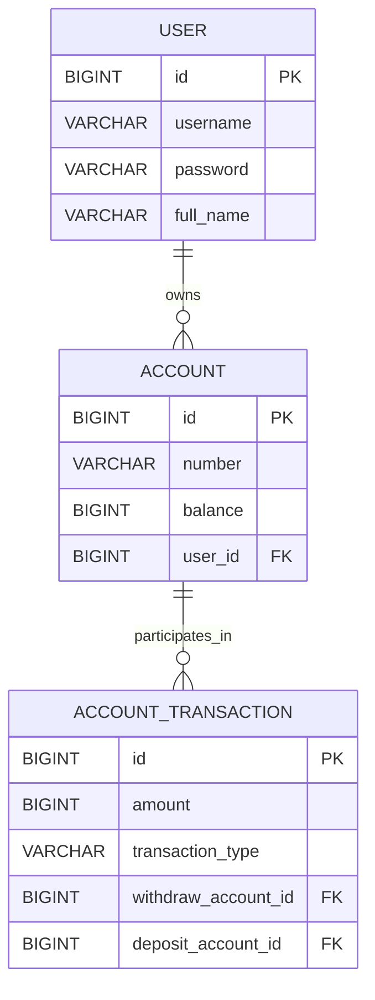

# ⚙️ Table Structure
### 🧩 Key Terms
| Term            | Meaning                                      |
| --------------- | -------------------------------------------- |
| **Deposit**     | Increase in account balance                  |
| **Withdraw**    | Decrease in account balance                  |
| **Transfer**    | Move funds between two accounts              |
| **Transaction** | Record of a deposit, withdrawal, or transfer |
| **Balance**     | Current account balance                      |
| **Account**     | User’s bank account                          |
| **User**        | Account owner                                |

### 🧑‍💼 user
| Column       | Type        | Description    |
| ------------ | ----------- | -------------- |
| `id`         | BIGINT (PK) | Unique user ID |
| `username`   | VARCHAR     | User login ID  |
| `password`   | VARCHAR     | User password  |
| `full_name`  | VARCHAR     | Full name      |
| `created_at` | TIMESTAMP   | Created time   |
| `updated_at` | TIMESTAMP   | Updated time   |

### 💳 account
| Column       | Type        | Description       |
| ------------ | ----------- | ----------------- |
| `id`         | BIGINT (PK) | Unique account ID |
| `number`     | VARCHAR     | Account number    |
| `balance`    | BIGINT      | Current balance   |
| `user_id`    | BIGINT (FK) | Owner (`user.id`) |
| `created_at` | TIMESTAMP   | Created time      |
| `updated_at` | TIMESTAMP   | Updated time      |

### 💸 account_transaction
| Column                     | Type        | Description                                          |
| -------------------------- | ----------- | ---------------------------------------------------- |
| `id`                       | BIGINT (PK) | Unique transaction ID                                |
| `amount`                   | BIGINT      | Transaction amount                                   |
| `transaction_type`         | VARCHAR     | Transaction type (`DEPOSIT`, `WITHDRAW`, `TRANSFER`) |
| `withdraw_account_balance` | BIGINT      | Balance of withdraw account after transaction        |
| `deposit_account_balance`  | BIGINT      | Balance of deposit account after transaction         |
| `withdraw_account_id`      | BIGINT (FK) | Withdraw account ID                                  |
| `deposit_account_id`       | BIGINT (FK) | Deposit account ID                                   |
| `created_at`               | TIMESTAMP   | Transaction time                                     |
| `updated_at`               | TIMESTAMP   | Updated time                                         |

## 🗂 ERD (Entity Relationship Diagram)

